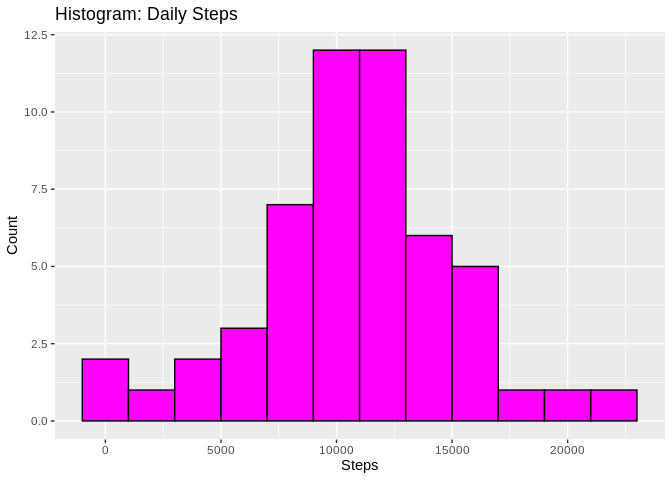
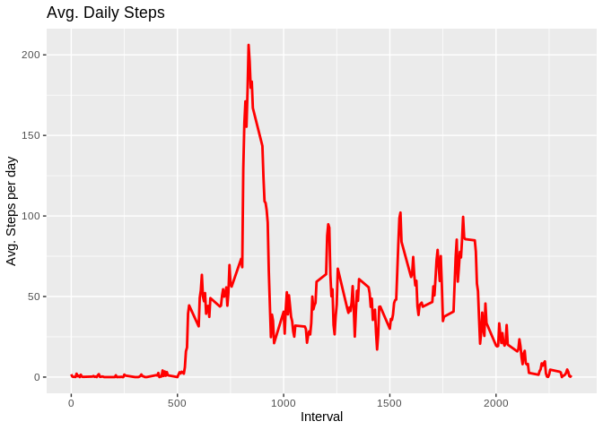
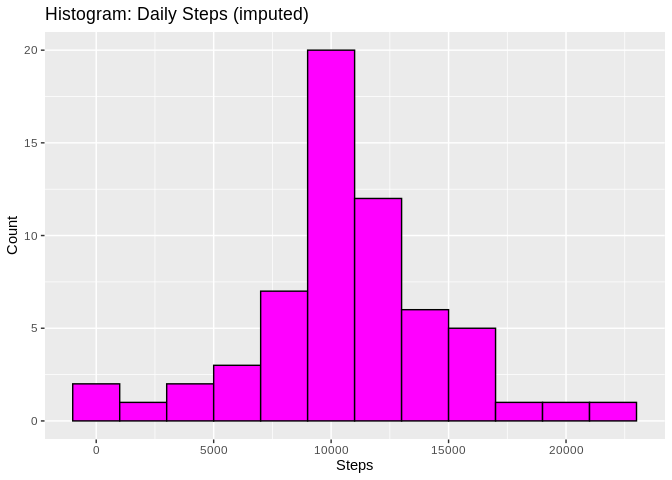
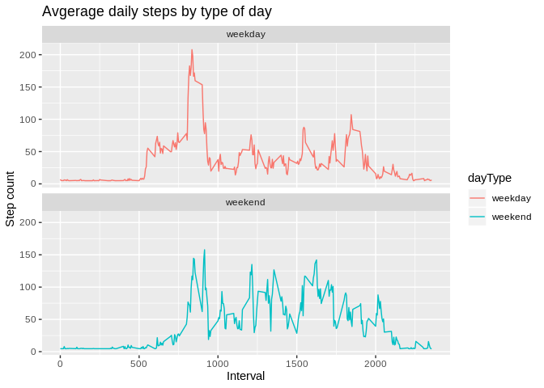

## Loading and preprocessing the data

```r
# libs
library(data.table)
```

```
## data.table 1.12.6 using 4 threads (see ?getDTthreads).  Latest news: r-datatable.com
```

```r
library(ggplot2) 

# extract, read and overview
unzip("activity.zip",exdir = "data")
activity <- fread(input = "data/activity.csv")
str(activity)
```

```
## Classes 'data.table' and 'data.frame':	17568 obs. of  3 variables:
##  $ steps   : int  NA NA NA NA NA NA NA NA NA NA ...
##  $ date    : chr  "2012-10-01" "2012-10-01" "2012-10-01" "2012-10-01" ...
##  $ interval: int  0 5 10 15 20 25 30 35 40 45 ...
##  - attr(*, ".internal.selfref")=<externalptr>
```

```r
summary(activity)
```

```
##      steps            date              interval     
##  Min.   :  0.00   Length:17568       Min.   :   0.0  
##  1st Qu.:  0.00   Class :character   1st Qu.: 588.8  
##  Median :  0.00   Mode  :character   Median :1177.5  
##  Mean   : 37.38                      Mean   :1177.5  
##  3rd Qu.: 12.00                      3rd Qu.:1766.2  
##  Max.   :806.00                      Max.   :2355.0  
##  NA's   :2304
```

#### 1. Calculate the total number of steps taken per day

```r
totalSteps <- activity[, c(lapply(.SD, sum, na.rm = FALSE)), .SDcols = c("steps"), by = .(date)] 
head(totalSteps, 3)
```

```
##          date steps
## 1: 2012-10-01    NA
## 2: 2012-10-02   126
## 3: 2012-10-03 11352
```

#### 2. Make a histogram of the total number of steps taken each day. 

```r
ggplot(totalSteps, aes(x = steps)) +
  geom_histogram(color = "black", fill = "magenta", binwidth = 2000) +
  labs(title = "Histogram: Daily Steps", x = "Steps", y = "Count")
```

```
## Warning: Removed 8 rows containing non-finite values (stat_bin).
```

<!-- -->

#### 3. Calculate and report the mean and median of the total number of steps taken per day

```r
totalSteps[, .(meanSteps = mean(steps, na.rm = TRUE), medianSteps = median(steps, na.rm = TRUE))]
```

```
##    meanSteps medianSteps
## 1:  10766.19       10765
```

## What is the average daily activity pattern?
#### 1. Make a time series plot (i.e. 𝚝𝚢𝚙𝚎 = "𝚕") of the 5-minute interval (x-axis) and the average number of steps taken, averaged across all days (y-axis)

```r
# create new table with average num. of steps taken in 5m interval
interval5m <- activity[, c(lapply(.SD, mean, na.rm = TRUE)), .SDcols = c("steps"), by = .(interval)]
ggplot(interval5m, aes(x = interval , y = steps)) + 
  geom_line(color= "red", size = 1) + 
  labs(title = "Avg. Daily Steps", x = "Interval", y = "Avg. Steps per day")
```

<!-- -->

#### 2. Which 5-minute interval, on average across all the days in the dataset, contains the maximum number of steps?

```r
interval5m[steps == max(steps), .(maxInterval = interval)]
```

```
##    maxInterval
## 1:         835
```

## Imputing missing values
#### 1. Calculate and report the total number of missing values in the dataset (i.e. the total number of rows with 𝙽𝙰s)

```r
nrow(activity[is.na(steps),])
```

```
## [1] 2304
```

#### 2. Devise a strategy for filling in all of the missing values in the dataset. The strategy does not need to be sophisticated. For example, you could use the mean/median for that day, or the mean for that 5-minute interval, etc.

```r
# take 5 min interval mean of steps to impute missing values in dataset
# r code in next cell under point 3.
```

#### 3. Create a new dataset that is equal to the original dataset but with the missing data filled in.

```r
activity[is.na(steps), "steps"] <- as.integer(interval5m[, c(lapply(.SD, mean, na.rm = TRUE)), .SDcols = c("steps")])
fwrite(x = activity, file = "data/tidyDataSet.csv", quote = FALSE)
```

#### 4. Make a histogram of the total number of steps taken each day and calculate and report the mean and median total number of steps taken per day. Do these values differ from the estimates from the first part of the assignment? What is the impact of imputing missing data on the estimates of the total daily number of steps?

```r
# recalculate total number of steps per day
totalSteps <- activity[, c(lapply(.SD, sum)), .SDcols = c("steps"), by = .(date)] 
# recalculate mean and median steps per day
totalSteps[, .(meanSteps = mean(steps), medianSteps = median(steps))]
```

```
##    meanSteps medianSteps
## 1:  10751.74       10656
```

```r
# plot new histogram
ggplot(totalSteps, aes(x = steps)) +
  geom_histogram(color = "black", fill = "magenta", binwidth = 2000) +
  labs(title = "Histogram: Daily Steps (imputed)", x = "Steps", y = "Count")
```

<!-- -->

## Are there differences in activity patterns between weekdays and weekends?
#### 1. Create a new factor variable in the dataset with two levels – “weekday” and “weekend” indicating whether a given date is a weekday or weekend day.

```r
activity[, date := as.POSIXct(date, format = "%Y-%m-%d")]
activity[, day:= weekdays(x = date)]
activity[grepl(pattern = "Monday|Tuesday|Wednesday|Thursday|Friday", x = day), "dayType"] <- "weekday"
activity[grepl(pattern = "Saturday|Sunday", x = day), "dayType"] <- "weekend"
activity[, dayType := as.factor(dayType)]
summary(activity[,"dayType"])
```

```
##     dayType     
##  weekday:12960  
##  weekend: 4608
```

#### 2. Make a panel plot containing a time series plot (i.e. 𝚝𝚢𝚙𝚎 = "𝚕") of the 5-minute interval (x-axis) and the average number of steps taken, averaged across all weekday days or weekend days (y-axis). See the README file in the GitHub repository to see an example of what this plot should look like using simulated data.

```r
activity[is.na(steps), "steps"] <- activity[, c(lapply(.SD, median, na.rm = TRUE)), .SDcols = c("steps")]
interval5m <- activity[, c(lapply(.SD, mean, na.rm = TRUE)), .SDcols = c("steps"), by = .(interval, dayType)] 
ggplot(interval5m , aes(x = interval , y = steps, color=dayType)) +
  geom_line() +
  labs(title = "Avgerage daily steps by type of day", x = "Interval", y = "Step count") +
  facet_wrap(~dayType , ncol = 1, nrow = 2)
```

<!-- -->
